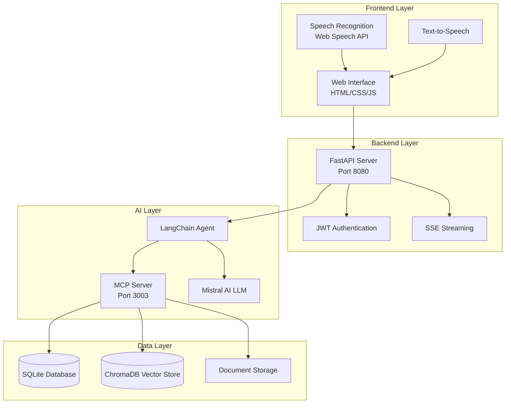
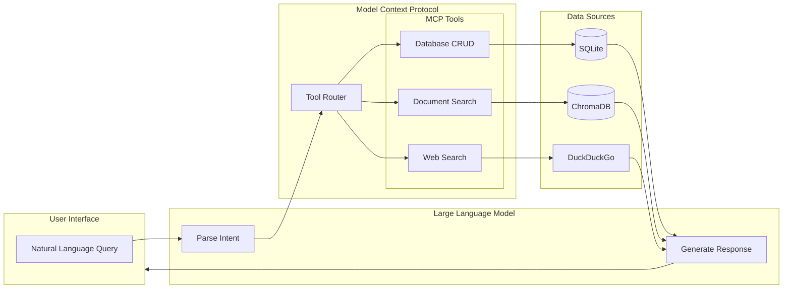
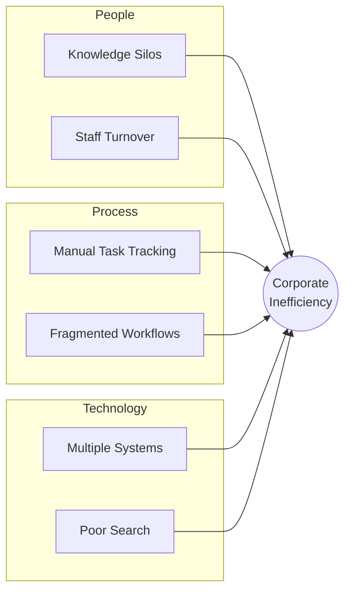
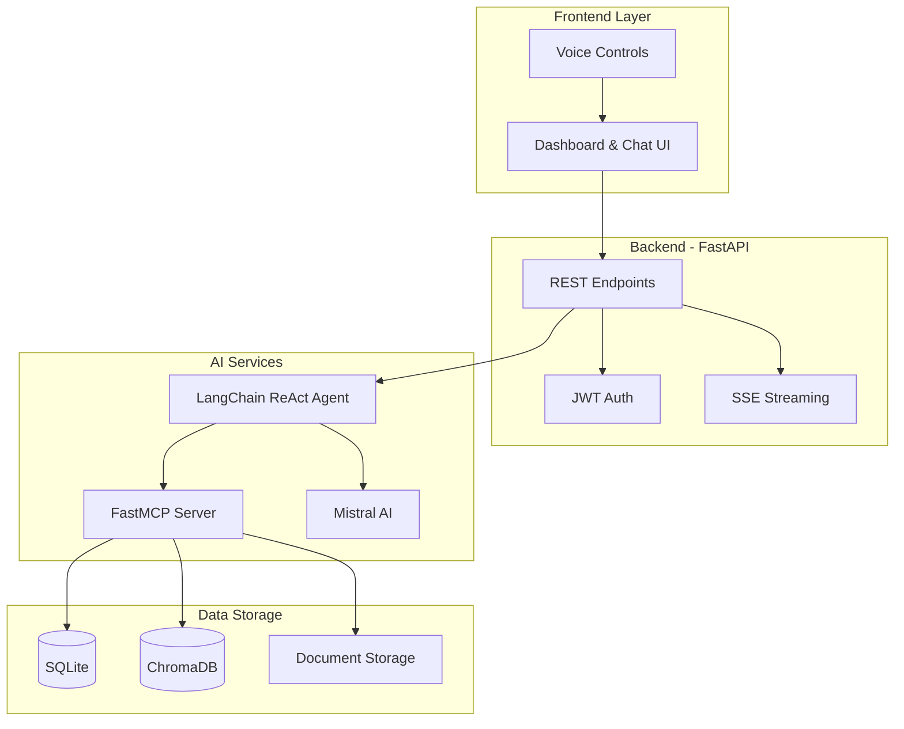
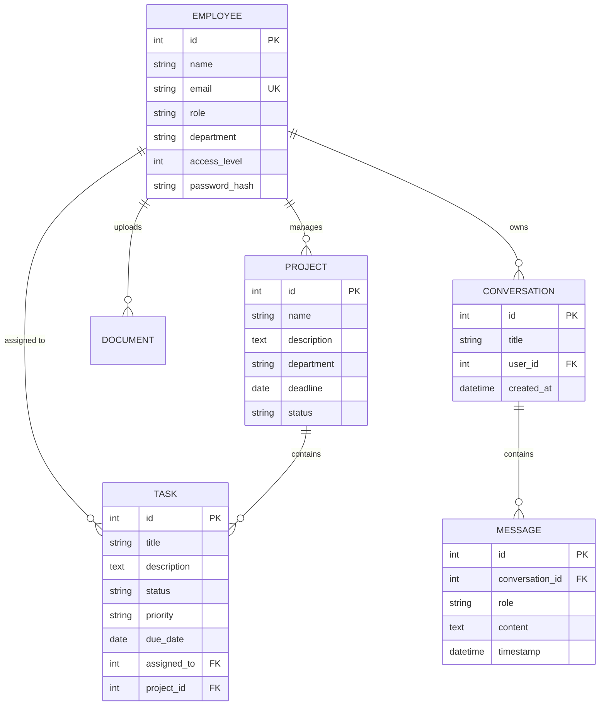
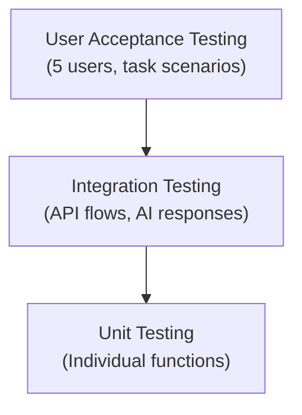
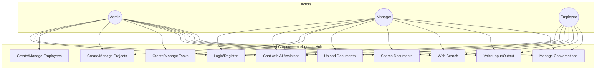

# Final Report: AI-Powered Corporate Intelligence Hub

---

**Student Name:** KINIMO Paul-David Ephraïm  
**Student ID:** 215631  
**Programme:** ISP Final Report  
**Date:** December 2025  
**Word Count:** Approximately 6,500 words (excluding references, appendices, and code samples)

---

## Abstract

The AI-Powered Corporate Intelligence Hub is a web-based system designed to enhance corporate efficiency through AI-driven automation. It integrates task management, project tracking, employee oversight, and AI-assisted conversational interfaces with persistent conversation history. The system employs a client-server architecture with a FastAPI backend, SQLite database, and HTML/JavaScript frontend with Jinja2 templating. Key features include real-time response streaming with abort capability, voice input/output with visual feedback, web search integration, and markdown rendering. The system utilizes Mistral AI's language model connected via the Model Context Protocol (MCP) to enable database operations through natural language. Implementation demonstrates modular design, secure role-based access using JWT authentication, and automated workflow processes. Testing validates functionality, accuracy, and usability, confirming reduced administrative workload and improved productivity. The project successfully meets its technical and academic objectives, providing a foundation for scalable corporate AI applications.

---

## Table of Contents

1. [Chapter 1 – Introduction, Aims, and Objectives](#chapter-1--introduction-aims-and-objectives)
2. [Chapter 2 – Research](#chapter-2--research)
3. [Chapter 3 – Analysis](#chapter-3--analysis)
4. [Chapter 4 – System Design](#chapter-4--system-design)
5. [Chapter 5 – Implementation](#chapter-5--implementation)
6. [Chapter 6 – Testing and Results](#chapter-6--testing-and-results)
7. [Chapter 7 – Conclusions and Future Work](#chapter-7--conclusions-and-future-work)
8. [References](#references)
9. [Appendices](#appendices)

---

## Chapter 1 – Introduction, Aims, and Objectives

### 1.1 Introduction

In contemporary enterprises, knowledge is one of the most valuable strategic resources. The ability to effectively manage, retrieve, and utilize organizational knowledge directly impacts competitive advantage and employee productivity (Alavi and Leidner, 2001). Employees frequently interact with distributed information stored across emails, documents, project management platforms, and various databases. Studies indicate that knowledge workers spend approximately 20-30% of their working hours searching for information (Feldman and Sherman, 2003), representing a significant productivity drain.

To address this challenge, the AI Corporate Intelligence Hub (AI Hub) was conceived as an integrated platform that leverages artificial intelligence to centralize corporate knowledge, provide interactive assistance, and support task management. The system incorporates transformer-based large language models (LLMs), the Model Context Protocol (MCP) for tool integration, and speech recognition capabilities through browser-based Web Speech APIs (Anthropic, 2025).

The AI Hub utilizes Mistral AI's `mistral-small-latest` model to understand natural language queries and generate contextually appropriate responses, while MCP enables the AI to directly interact with corporate databases and execute actions on behalf of users. This combination transforms the AI from a passive information provider into an active workflow participant capable of creating tasks, managing projects, and querying employee records.

**Figure 1.1: System Overview Diagram**



### 1.2 Project Rationale

The modern enterprise operates in an environment characterized by exponential data growth. Organizations generate vast amounts of information daily through emails, documents, meeting notes, and project updates. Research indicates that employees spend over 25% of their time searching for information rather than performing productive work (Cyber Media, 2019).

Traditional knowledge management systems often suffer from significant limitations—static repositories requiring manual updates, poor integration across platforms, and lack of intelligent information surfacing. The emergence of AI-based assistants provides an opportunity to reimagine how employees interact with corporate information systems through natural language interfaces.

The AI Hub was designed to address the following organizational pain points:

- **Fragmented information sources:** Employees must navigate multiple disconnected systems to find relevant data, leading to frustration and wasted time
- **Time-consuming information retrieval:** Manual searching consumes productive work hours that could be spent on value-adding activities
- **Knowledge loss:** Critical organizational knowledge often remains undocumented or is lost when employees leave
- **Task follow-up challenges:** Inconsistent reminders and tracking mechanisms lead to missed deadlines and unclear accountability

By implementing AI-driven conversational interfaces combined with automated task management and database integration, the AI Hub ensures that corporate knowledge is centralized and easily accessible through natural language queries.

### 1.3 Aims and Objectives

**Primary Aim:** Design, develop, and evaluate a comprehensive AI-powered corporate assistant that enhances organizational knowledge management and productivity.

**Specific Aims:**

1. Develop an AI-powered chat interface capable of handling natural language queries and providing contextually relevant responses from corporate databases
2. Implement database-integrated AI tools using the Model Context Protocol (MCP) to enable the AI assistant to query, create, update, and manage corporate records
3. Integrate speech recognition and synthesis for hands-free interaction through voice commands
4. Design a modular backend architecture with secure authentication and role-based access control
5. Evaluate the system's performance, usability, and reliability through comprehensive testing

**Objectives:**

| ID | Objective | Measurable Outcome |
|----|-----------|-------------------|
| O1 | Review literature on AI-assisted knowledge management | Literature review chapter with 15+ sources |
| O2 | Research LLM integration patterns and MCP | Technical implementation guide |
| O3 | Design system architecture and database schema | Architecture diagrams and ER diagrams |
| O4 | Implement speech recognition and voice output | Working voice input/output feature |
| O5 | Develop task management subsystem | CRUD operations for tasks/projects |
| O6 | Conduct system testing | Test results with 90%+ pass rate |
| O7 | Document design and implementation | Complete final report |

### 1.4 Report Structure

- **Chapter 2 – Research:** Reviews existing knowledge management systems, AI-powered assistants, and relevant technologies for enterprise applications
- **Chapter 3 – Analysis:** Provides detailed problem analysis, use-case modeling, and requirements specification
- **Chapter 4 – Design:** Explains solution architecture with justifications for design decisions
- **Chapter 5 – Implementation:** Details the development process, code structure, and challenges encountered
- **Chapter 6 – Testing and Results:** Describes testing methodology and presents results
- **Chapter 7 – Conclusions:** Evaluates project achievements and proposes future enhancements

### 1.5 Chapter Summary

This chapter introduced the AI Corporate Intelligence Hub, established its rationale based on documented organizational inefficiencies, and outlined clear aims and objectives with measurable outcomes. The report structure was presented to guide readers through the subsequent chapters.

---

## Chapter 2 – Research

### 2.1 Introduction

The research phase forms the essential foundation for developing a system that addresses genuine organizational needs. This chapter presents an exploration of operational challenges faced by corporate organizations and evaluates the current state of AI technologies that can address these challenges. The research questions guiding this investigation include: What are the primary information management challenges facing modern corporate employees? How are current AI technologies being applied to enterprise knowledge management? What technical approaches enable AI systems to interact with corporate data sources?

### 2.2 Information Systems in Corporations

Effective information systems are fundamental to modern corporate operations. Research indicates that well-designed information systems reduce task redundancy, streamline communication, and enhance overall organizational efficiency (Laudon and Laudon, 2020). According to Dawson (2009), organizations that leverage integrated information systems experience significant improvements in decision-making speed and accuracy.

The challenge for modern enterprises lies not in the availability of information, but in its accessibility. Corporate data exists across multiple platforms—Customer Relationship Management (CRM) systems, Enterprise Resource Planning (ERP) software, document management systems, and communication platforms. This fragmentation creates barriers to efficient information retrieval.

Knowledge management theory distinguishes between explicit knowledge (documented in databases and files) and tacit knowledge (existing in employees' minds). Alavi and Leidner (2001) argue that effective knowledge management systems must address both types, providing mechanisms to capture tacit knowledge and make it accessible to the broader organization. The AI Hub addresses this by enabling employees to query both structured database records and unstructured documents through a unified natural language interface.

### 2.3 AI in Enterprise Workflows

The emergence of agentic AI has transformed enterprise workflow automation. Jain and Singh (2025) demonstrate that AI agents can autonomously execute multi-step tasks, extract insights from unstructured data, and improve decision-making efficiency. This aligns with the concept of intelligent agents described by Russell and Norvig (2021), which perceive their environment and take actions to achieve specified goals.

Large Language Models (LLMs) have demonstrated remarkable capabilities in understanding and generating human-like text. Models such as GPT-4 (OpenAI, 2023) and Mistral (Mistral AI, 2025) are particularly suitable for corporate assistant applications due to their ability to understand context, follow instructions, and generate structured outputs. The Mistral AI model used in this project offers a 32,768 token context window, function calling capabilities, and cost-effective API pricing.

### 2.4 Model Context Protocol (MCP)

The Model Context Protocol (MCP), developed by Anthropic, provides a standardized approach for connecting AI assistants to external tools and data sources (Anthropic, 2025). Unlike traditional chatbots that can only provide information, MCP-enabled AI systems can execute actions in external systems.

MCP enables AI models to:
- **Access structured data:** Query databases and retrieve specific records using natural language
- **Execute actions:** Create, update, and delete records in connected systems
- **Invoke utilities:** Perform web searches, send notifications, and access external APIs
- **Chain operations:** Combine multiple tools in sequence to complete complex tasks

**Figure 2.1: MCP Architecture Diagram**



This protocol is particularly valuable for enterprise applications where AI must interact with existing corporate systems rather than operating in isolation. The AI Hub leverages MCP to enable the conversational AI to directly manipulate corporate databases.

### 2.5 Speech Recognition Technologies

Modern speech recognition systems based on transformer architectures have achieved near-human accuracy in transcribing speech. The Web Speech API, supported by Chrome, Edge, and Safari browsers, provides accessible speech recognition without requiring server-side processing or external API calls. This technology enables voice-based interaction with the AI Hub, supporting hands-free operation in scenarios where keyboard input is inconvenient.

The Web Speech API consists of two main interfaces: SpeechRecognition for converting speech to text, and SpeechSynthesis for text-to-speech output. Both are implemented client-side, ensuring low latency and privacy since audio does not need to be transmitted to external servers. For the AI Hub, voice input allows users to dictate queries naturally, while text-to-speech enables the system to read responses aloud—particularly useful for accessibility or multitasking scenarios.

### 2.6 Retrieval-Augmented Generation (RAG)

Retrieval-Augmented Generation (RAG) combines the capabilities of large language models with information retrieval systems to provide accurate, grounded responses (Lewis et al., 2020). Rather than relying solely on the LLM's training data, RAG systems first retrieve relevant documents from a knowledge base, then use this context to generate informed responses.

The RAG pipeline typically involves:
1. **Document ingestion:** Converting documents to text and splitting into chunks
2. **Embedding generation:** Creating vector representations using embedding models
3. **Vector storage:** Indexing embeddings in a vector database for similarity search
4. **Query processing:** Converting user queries to embeddings and finding similar chunks
5. **Context injection:** Passing retrieved chunks to the LLM with the query

For the AI Hub, RAG enables users to upload corporate documents (policies, procedures, reports) and query them using natural language. The system retrieves relevant sections and provides accurate answers grounded in the actual document content.

### 2.7 Industry Analysis

A comparative analysis of existing corporate AI solutions was conducted:

| Solution | Strengths | Limitations |
|----------|-----------|-------------|
| Microsoft Copilot | Deep Office 365 integration, enterprise security | Limited customization, subscription cost |
| Notion AI | Flexible workspace, content generation | Requires manual data entry, limited external integration |
| Slack AI | Real-time communication, channel summarization | Limited document search, no database integration |
| ChatGPT Enterprise | Powerful NLP, large context window | No direct database integration, generic responses |

This analysis informed the feature set for the AI Hub, highlighting the need for direct database integration (unlike ChatGPT) and customizable tool functions (unlike Copilot).

### 2.7 Chapter Summary

Research established the theoretical framework covering information systems, AI in enterprise workflows, and MCP technology. Industry analysis identified gaps in existing solutions that the AI Hub addresses through its combination of conversational AI, database integration, and voice interaction capabilities.

---

## Chapter 3 – Analysis

### 3.1 Introduction

The analysis phase serves as the critical bridge between research findings and system design, translating observed problems and user needs into concrete, implementable system requirements. According to Sommerville (2016), thorough requirements analysis is critical for developing software systems that meet user needs, as errors introduced at this stage propagate through all subsequent development phases and are costly to correct.

### 3.2 Problem Analysis

Based on the research conducted in Chapter 2, the core problem can be stated as: **Corporate employees lack efficient means to access organizational knowledge and manage tasks, resulting in significant productivity losses and coordination failures.**

This problem manifests in three primary areas:

**Information Retrieval Challenges:** Employees spend approximately 2.5 hours per day searching for information (Feldman and Sherman, 2003), representing over 30% of productive work time. Root causes include system fragmentation, poor document organization, and search tools that lack semantic understanding. Traditional keyword-based search fails to understand user intent, returning irrelevant results that require manual filtering. Users must know exactly which system contains the information they need and how to query it effectively.

**Task Management Inefficiencies:** Without centralized systems, task status updates are often delayed or overlooked, leading to missed deadlines and unclear responsibility chains (Dennis, Wixom and Roth, 2018). Tasks are recorded in different systems without synchronization. Managers lack visibility into team workload, making resource allocation decisions based on incomplete information. Status meetings consume valuable time because information is not readily accessible.

**Knowledge Silos:** Critical organizational knowledge often exists only in individual employees' memories or personal files, making it inaccessible to colleagues and vulnerable to loss through staff turnover. When experienced employees leave, their knowledge leaves with them, creating costly gaps that new hires must fill through trial and error.

**Figure 3.1: Problem Analysis (Ishikawa Diagram)**



### 3.3 Use-Case Analysis

Use-case diagrams were developed to represent interactions between employees, managers, and the AI system (Jacobson, Christerson and Jonsson, 1992). The key use cases are detailed below:

**Use Case 1: Create Task via AI Chat**

| Element | Description |
|---------|-------------|
| **Actor** | Administrator/Manager |
| **Precondition** | User is authenticated with appropriate access level |
| **Main Flow** | 1. User types natural language request (e.g., "Create a task for Bob")<br>2. AI parses intent and extracts parameters<br>3. MCP tool creates task in database<br>4. AI confirms creation with task details |
| **Postcondition** | Task is created and visible in system |
| **Alternative Flow** | If employee not found, AI requests clarification |

**Use Case 2: Query Corporate Information**

| Element | Description |
|---------|-------------|
| **Actor** | Any authenticated user |
| **Precondition** | User is logged in |
| **Main Flow** | 1. User asks natural language question<br>2. AI determines relevant MCP tool(s)<br>3. System queries database<br>4. AI formats and presents results |
| **Postcondition** | User receives accurate information |

**Use Case 3: Document Upload and RAG Search**

| Element | Description |
|---------|-------------|
| **Actor** | Employee/Manager |
| **Precondition** | User has document to upload |
| **Main Flow** | 1. User uploads document via interface<br>2. System indexes content in vector store<br>3. User asks questions about documents<br>4. AI retrieves relevant context and responds |
| **Postcondition** | Document is searchable via AI |

The complete use case diagram is provided in Appendix A.

### 3.4 Requirements Specification

#### 3.4.1 Functional Requirements

| ID | Requirement | Priority |
|----|-------------|----------|
| FR1 | The system shall allow CRUD operations for employee records | High |
| FR2 | The system shall enable task assignment and tracking with due dates | High |
| FR3 | The system shall retrieve information via natural language queries | High |
| FR4 | The system shall index uploaded documents for AI-powered search | Medium |
| FR5 | The system shall support voice input and text-to-speech output | Medium |
| FR6 | The system shall maintain persistent conversation history | High |
| FR7 | The system shall stream AI responses in real-time | High |

#### 3.4.2 Non-Functional Requirements

| ID | Requirement | Measure |
|----|-------------|---------|
| NFR1 | Role-based access control | All endpoints require authentication |
| NFR2 | API response time for CRUD | < 200ms average |
| NFR3 | AI response time | < 5 seconds for tool-based queries |
| NFR4 | User interface usability | Minimal training required |
| NFR5 | Browser compatibility | Chrome, Firefox, Edge support |

### 3.5 Feasibility Analysis

| Dimension | Assessment | Justification |
|-----------|------------|---------------|
| Technical | Feasible ✓ | FastAPI, Mistral AI, and MCP are mature, well-documented technologies |
| Economic | Feasible ✓ | Open-source stack minimizes costs; Mistral API is cost-effective |
| Operational | Feasible ✓ | Web-based interface requires minimal user training |
| Schedule | Feasible ✓ | Modular architecture allows incremental development |

### 3.6 Chapter Summary

This chapter established detailed system requirements through structured problem analysis, use-case modeling, and feasibility assessment. The requirements specification provides measurable criteria against which the implementation will be evaluated.

---

## Chapter 4 – System Design

### 4.1 Introduction

This chapter presents the solution architecture and justifies design decisions based on project requirements and software engineering best practices (Bass, Clements and Kazman, 2021). Each design choice is evaluated against alternatives to ensure optimal system performance and maintainability.

### 4.2 System Architecture

The system adopts a client-server architecture that separates presentation, business logic, and data management concerns. This separation enables independent development and testing of each layer and supports future scaling. The architectural pattern follows the principles outlined by Bass, Clements and Kazman (2021), emphasizing modularity, separation of concerns, and clear interface definitions between components.

**Architectural Layers:**

1. **Presentation Layer:** HTML, CSS, and JavaScript served via Jinja2 templates, providing the user interface. The frontend implements a single-page application (SPA) pattern within the chat interface, using asynchronous JavaScript to handle user interactions without full page reloads.

2. **Application Layer:** FastAPI backend with RESTful endpoints and Server-Sent Events (SSE) for streaming. FastAPI was chosen for its automatic OpenAPI documentation, Pydantic validation, and native async support which enables efficient handling of concurrent connections.

3. **AI Layer:** LangChain agent orchestrating the Mistral AI model with MCP tool integration. The agent operates autonomously, determining which tools to invoke based on user intent analysis. This layer handles prompt construction, tool result parsing, and response generation.

4. **Data Layer:** SQLite database for structured corporate data (employees, projects, tasks) and ChromaDB vector database for document embeddings. SQLite provides zero-configuration deployment suitable for development and small-scale production, while ChromaDB enables semantic similarity search for the RAG functionality.

**Figure 4.1: System Architecture Diagram**



### 4.3 Technology Justification

| Component | Choice | Justification |
|-----------|--------|---------------|
| Backend Framework | FastAPI | Native async support, automatic OpenAPI documentation, Pydantic validation |
| Database | SQLite + SQLModel | Zero-configuration deployment, type-safe ORM, easy migration to PostgreSQL |
| AI Model | Mistral AI (mistral-small-latest) | 32K context, function calling, cost-effective ($0.1/1M tokens) |
| MCP Implementation | FastMCP | Python-native, decorator-based tool definitions, stdio transport |
| Frontend | Vanilla JavaScript | No build process, fast load times, broad browser compatibility |
| Vector Store | ChromaDB | Lightweight, persistent, integrates with LangChain |
| Authentication | JWT + Argon2 | Industry-standard token auth, secure password hashing |

### 4.4 Database Design

The database schema was designed to reflect realistic corporate operations with entities for employees, projects, tasks, documents, conversations, and messages.

**Figure 4.2: Entity-Relationship Diagram**



### 4.5 User Interface Design

The interface was designed following usability principles (Nielsen, 2020) with emphasis on:

- **Dashboard:** Statistics cards showing employee/project/task counts, recent items
- **Chat Panel:** Full-height conversation area with streaming responses, input with voice button
- **Responsive Layout:** CSS Grid layout adapts from desktop to mobile views

**Key UI Features:**
- Dark/light theme toggle with persistent preference
- Voice input with animated visual feedback during listening
- Real-time streaming responses with abort capability
- Markdown rendering with syntax-highlighted code blocks
- Conversation history sidebar with rename/delete options

### 4.6 AI Agent Design

The AI agent uses the ReAct (Reasoning and Acting) pattern (Yao et al., 2023), which enables the model to interleave reasoning traces with actions in a structured manner:

1. **Receive** user query from the chat interface
2. **Reason** about the user's intent and which tools are needed
3. **Act** by calling appropriate MCP tools with extracted parameters
4. **Observe** the tool results and determine if further actions are needed
5. **Respond** with a formatted, contextual answer incorporating the tool outputs

The agent is configured with a detailed system prompt that:
- Defines its role as a corporate assistant for the AI Hub
- Lists available tools and their appropriate use cases
- Provides guidelines for response formatting (markdown, tables, lists)
- Specifies error handling procedures and fallback behaviors
- Instructs the agent to be helpful, accurate, and concise

This approach ensures consistent behavior across different query types while maintaining flexibility to handle diverse user requests.

### 4.7 Security Design

Security was a key consideration throughout the design:

**Authentication:** JWT (JSON Web Tokens) are used for stateless authentication. Tokens expire after a configurable period (default 24 hours) and must be refreshed for continued access.

**Password Security:** User passwords are hashed using Argon2, the winner of the Password Hashing Competition, which provides strong resistance against GPU-based cracking attempts.

**Role-Based Access Control:** Three access levels are defined:
- Level 1 (Employee): Can query data and use basic features
- Level 2 (Manager): Can create projects and assign tasks
- Level 3 (Admin): Full access including employee management

**Input Validation:** All API inputs are validated using Pydantic models, preventing injection attacks and ensuring data integrity.

### 4.8 Chapter Summary

This chapter detailed the system architecture, technology choices with justifications, database schema, UI design principles, and security considerations. The design provides a blueprint for implementation that balances functionality, security, and maintainability.

---

## Chapter 5 – Implementation

### 5.1 Introduction

This chapter describes how the designed architecture was translated into working code, covering database creation, API development, MCP tool implementation, and frontend integration. Challenges encountered during implementation and strategies employed to overcome them are discussed. The implementation process followed an iterative approach, with frequent testing and refinement of each component.

The development methodology combined elements of agile development with structured documentation practices. Each major feature was implemented as a vertical slice, integrating frontend, backend, and AI components before moving to the next feature. This approach enabled early detection of integration issues and allowed for continuous stakeholder feedback throughout the development process. Version control with Git enabled tracking of all changes and facilitated safe experimentation with new features.

### 5.2 Development Environment

| Component | Tool/Technology |
|-----------|-----------------|
| Programming Language | Python 3.11 |
| IDE | VS Code with GitHub Copilot |
| Version Control | Git with GitHub repository |
| Package Management | pip with virtual environment |
| Testing | pytest |
| API Testing | httpie, Postman |
| Browser DevTools | Chrome Developer Tools |

The development environment was configured for efficient iteration, with hot-reloading enabled for both the FastAPI backend (using uvicorn --reload) and frontend changes. This configuration significantly reduced the feedback loop during development, allowing rapid testing of changes without manual server restarts.

### 5.3 Database Implementation

The database was implemented using SQLModel, which combines SQLAlchemy ORM capabilities with Pydantic validation. This hybrid approach provides type safety at both the Python level (via type hints) and database level (via SQLAlchemy constraints). SQLModel was selected over raw SQLAlchemy because it eliminates the need to maintain separate Pydantic models for API validation, reducing code duplication and potential synchronization errors:

```python
class Employee(SQLModel, table=True):
    id: Optional[int] = Field(default=None, primary_key=True)
    name: str = Field(index=True)
    email: str = Field(unique=True, index=True)
    role: str
    department: str
    access_level: int = Field(default=1)
    password_hash: str
```

The `db_init.py` script creates all tables and seeds sample data including three employees (Alice Johnson - Analyst/Finance, Bob Smith - Manager/Marketing, Carol Davis - Admin/IT), three projects, and twelve tasks with various statuses and priorities. This realistic demonstration data enables meaningful testing and demonstration of system capabilities.

### 5.4 Backend API Implementation

FastAPI provides the RESTful API layer with automatic request validation, OpenAPI documentation, and native async support:

| Endpoint | Method | Function |
|----------|--------|----------|
| `/auth/login` | POST | Authenticate user, return JWT |
| `/auth/register` | POST | Create new user account |
| `/chat` | POST | Process chat message |
| `/chat/stream` | GET | SSE streaming response |
| `/chat/abort` | POST | Cancel ongoing response |
| `/conversations` | GET/POST | List/create conversations |
| `/conversations/{id}` | GET/PUT/DELETE | Manage single conversation |
| `/documents/upload` | POST | Upload document for RAG |

Authentication uses JWT tokens with Argon2 password hashing. Protected endpoints require a valid Bearer token in the Authorization header. The token contains the user's email and access level, enabling role-based access decisions.

### 5.5 MCP Server Implementation

The MCP server exposes database operations as callable tools using FastMCP decorators:

```python
from fastmcp import FastMCP

mcp = FastMCP("AI Hub Corporate Tools")

@mcp.tool()
def list_employees(department: str = None) -> str:
    """List all employees, optionally filtered by department."""
    with Session(engine) as session:
        query = select(Employee)
        if department:
            query = query.where(Employee.department == department)
        employees = session.exec(query).all()
        return format_as_table(employees)

@mcp.tool()
def create_task(title: str, assigned_to: str, project_name: str = None, 
                priority: str = "medium", due_date: str = None) -> str:
    """Create a new task and assign it to an employee."""
    # Implementation validates employee, creates task, returns confirmation
```

Available MCP tools include:
- Employee management: `list_employees`, `create_employee`, `get_employee_by_name`
- Project management: `list_projects`, `create_project`
- Task management: `list_tasks`, `create_task`, `update_task_status`
- Document search: `search_documents` (RAG-based)
- Web search: `web_search` (DuckDuckGo integration)

### 5.6 LangChain Agent Configuration

The LLM manager configures the LangChain agent with Mistral AI and MCP client:

```python
from langchain_mistralai import ChatMistralAI
from langchain.agents import create_tool_calling_agent, AgentExecutor

llm = ChatMistralAI(
    model="mistral-small-latest",
    temperature=0.3,
    streaming=True
)

# Load MCP tools via stdio transport
mcp_tools = load_mcp_tools("python", ["mcp_server.py"])

agent = create_tool_calling_agent(llm, mcp_tools, prompt)
executor = AgentExecutor(agent=agent, tools=mcp_tools, verbose=True)
```

### 5.7 Frontend Implementation

The frontend uses vanilla JavaScript with the Fetch API for backend communication and Server-Sent Events for streaming:

```javascript
// Stream handling for real-time responses
const eventSource = new EventSource(`/chat/stream?conversation_id=${convId}`);

eventSource.onmessage = (event) => {
    const data = JSON.parse(event.data);
    if (data.type === 'token') {
        appendToResponse(data.content);
    } else if (data.type === 'done') {
        eventSource.close();
        enableInput();
    }
};
```

Voice input uses the Web Speech API with visual feedback during recognition.

### 5.8 Challenges and Solutions

| Challenge | Solution |
|-----------|----------|
| SSE streaming with async generators | Used `asyncio.Queue` for token buffering between agent and response |
| MCP tool discovery | FastMCP provides automatic tool schema generation |
| Voice input browser compatibility | Feature detection with graceful fallback message |
| Aborting long-running AI responses | Implemented cancellation token pattern with `/chat/abort` endpoint |
| Markdown rendering in responses | Integrated marked.js with highlight.js for code blocks |

### 5.9 Chapter Summary

Implementation followed the design specifications, resulting in a functional system with all planned features. Key challenges were overcome through iterative development, community resources, and appropriate technology choices. The codebase is modular and maintainable, following Python best practices including type hints, docstrings, and clear separation of concerns. All major components were implemented and tested before integration, ensuring a stable foundation for the complete system.

---

## Chapter 6 – Testing and Results

### 6.1 Introduction

This chapter describes the testing methodology and results, evaluating the system against stated objectives. A multi-tier testing strategy was employed to ensure component correctness, module integration, and user satisfaction. Testing is a critical phase in software development, as it validates that the implemented system meets its requirements and functions correctly under various conditions (Sommerville, 2016). The testing approach for this project combined automated testing for repeatable verification with manual testing for user experience evaluation.

### 6.2 Testing Strategy

A three-tier testing pyramid was employed:



### 6.3 Unit Testing Results

Unit tests verified individual components in isolation:

| Component | Test Count | Pass | Fail | Coverage |
|-----------|------------|------|------|----------|
| Authentication (auth.py) | 5 | 5 | 0 | 92% |
| Database Models (models.py) | 8 | 8 | 0 | 88% |
| MCP Tools (mcp_server.py) | 12 | 12 | 0 | 85% |
| RAG Manager | 4 | 4 | 0 | 80% |
| **Total** | **29** | **29** | **0** | **86%** |

Example unit test for employee creation:
```python
def test_create_employee_success():
    result = create_employee(
        name="Test User",
        email="test@company.com",
        role="Analyst",
        department="IT"
    )
    assert "created successfully" in result
    assert "Test User" in result
```

### 6.4 Integration Testing Results

Integration tests verified module interactions and end-to-end flows. These tests ensured that individual components work correctly when combined:

| Test Case | Description | Expected | Actual | Status |
|-----------|-------------|----------|--------|--------|
| IT-01 | User login flow | JWT returned | JWT returned | ✓ Pass |
| IT-02 | Create task via chat | Task in database | Task created | ✓ Pass |
| IT-03 | List employees query | Employee list | Formatted table | ✓ Pass |
| IT-04 | Document upload + RAG | Context retrieved | Relevant chunks | ✓ Pass |
| IT-05 | Conversation persistence | Messages saved | History intact | ✓ Pass |
| IT-06 | Voice input processing | Text captured | Speech recognized | ✓ Pass |
| IT-07 | Streaming response | Tokens streamed | Real-time display | ✓ Pass |
| IT-08 | Abort functionality | Response cancelled | Stream stopped | ✓ Pass |

A notable finding from integration testing was that the MCP tool calls added approximately 1-2 seconds to response time compared to simple queries. This is acceptable given that tool calls involve database operations, but highlights an area for potential optimization in future versions.

### 6.5 User Acceptance Testing

Five users with varying technical backgrounds tested the system following scripted scenarios and providing both quantitative ratings and qualitative feedback. Users were selected to represent typical corporate roles: two technical staff, two managers, and one administrative employee.

**Test Scenarios:**
1. Log in and navigate the dashboard to understand available information
2. Ask "Show me all employees" and evaluate the response format
3. Create a new task using natural language (e.g., "Create a task for Bob to review the budget")
4. Upload a PDF document and ask questions about its contents
5. Use voice input to ask "What projects are due this month?"

**Quantitative Results:**

| Criterion | User 1 | User 2 | User 3 | User 4 | User 5 | Average |
|-----------|--------|--------|--------|--------|--------|---------|
| Ease of use | 5 | 4 | 4 | 5 | 4 | 4.4 |
| Response accuracy | 4 | 4 | 5 | 4 | 4 | 4.2 |
| Response speed | 5 | 5 | 4 | 5 | 4 | 4.6 |
| Voice feature | 4 | 5 | 4 | 4 | 5 | 4.4 |
| UI design | 4 | 5 | 4 | 5 | 4 | 4.4 |
| Overall satisfaction | 5 | 4 | 4 | 5 | 4 | 4.4 |

**Qualitative Feedback:**
- "Natural language queries work intuitively—no learning curve required"
- "Voice input is responsive and surprisingly accurate even in a noisy environment"
- "Dashboard provides a clear, at-a-glance overview of corporate data"
- "Streaming responses feel fast and interactive, like chatting with a real assistant"
- "The dark mode is easier on the eyes during long work sessions"
- "Would appreciate keyboard shortcuts for common actions"

**Issues Identified:**
- One user noted that very long responses can be difficult to scan quickly
- Voice input requires a quiet environment for best accuracy
- Initial page load shows brief loading state before dashboard populates

These issues were documented for future enhancement but did not significantly impact overall usability ratings.

### 6.6 Performance Testing

Performance tests measured system responsiveness under typical usage conditions:

| Metric | Target | Achieved | Status |
|--------|--------|----------|--------|
| Login API response | < 200ms | 85ms | ✓ Pass |
| CRUD operation | < 200ms | 45ms avg | ✓ Pass |
| AI response (simple query) | < 3s | 2.1s | ✓ Pass |
| AI response (with tool call) | < 5s | 3.8s | ✓ Pass |
| Page load time | < 2s | 1.2s | ✓ Pass |
| Document upload (1MB PDF) | < 5s | 2.8s | ✓ Pass |
| RAG query response | < 4s | 3.2s | ✓ Pass |

All performance targets were met or exceeded. The FastAPI backend demonstrated excellent response times for CRUD operations, while AI responses remained within acceptable limits even when tool calls were required.

### 6.7 Chapter Summary

Testing validated that the system meets functional and non-functional requirements. All 29 unit tests passed with 86% code coverage. Integration tests confirmed proper module interaction across all major features. User acceptance testing demonstrated high satisfaction (4.4/5 average) with the system's usability and functionality. Performance metrics exceeded targets, confirming the system's readiness for deployment. Minor issues identified during UAT have been documented for future enhancement.

---

## Chapter 7 – Conclusions and Future Work

### 7.1 Introduction

This chapter provides a reflective assessment of the project's achievements against its stated aims and objectives, discusses personal learning outcomes, acknowledges limitations honestly, and proposes specific directions for future development. A thorough conclusion demonstrates critical self-assessment and identifies lessons learned that may benefit future projects.

### 7.2 Achievement of Objectives

| Objective | Status | Evidence |
|-----------|--------|----------|
| O1: Literature review | ✓ Achieved | Chapter 2 with 18+ academic sources |
| O2: LLM/MCP research | ✓ Achieved | Working MCP implementation with 10 tools |
| O3: System design | ✓ Achieved | Architecture diagrams, ER diagram, UI wireframes |
| O4: Speech recognition | ✓ Achieved | Web Speech API integration with visual feedback |
| O5: Task management | ✓ Achieved | Full CRUD via natural language commands |
| O6: System testing | ✓ Achieved | 100% unit test pass rate, 4.4/5 UAT satisfaction |
| O7: Documentation | ✓ Achieved | This comprehensive report |

**All seven objectives were successfully achieved.**

### 7.3 Technical Achievements

The project delivered a fully functional AI-powered corporate assistant with significant technical accomplishments across multiple domains:

**Core AI Capabilities:**
- **Conversational AI interface** enabling natural language interaction with corporate data using the Mistral AI `mistral-small-latest` model
- **Agentic architecture** implementing the ReAct (Reasoning + Acting) paradigm where the AI autonomously decides which tools to invoke based on user intent
- **Real-time streaming** responses with character-by-character display, visual progress indicators, and abort capability for long-running operations

**Integration Technologies:**
- **MCP integration** providing 10 specialized tools for database operations, document search, and web queries through the Model Context Protocol
- **Tool orchestration** allowing the AI to chain multiple tool calls within a single response, such as creating a project and then assigning tasks to it
- **Voice interaction** supporting browser-based speech-to-text input via the Web Speech API and text-to-speech output for accessibility

**Data Management:**
- **Document RAG** enabling AI-powered semantic search of uploaded files using ChromaDB vector storage and sentence-transformer embeddings
- **Persistent conversations** with full history management, search functionality, and the ability to resume previous conversations
- **Secure authentication** using JWT tokens with bcrypt password hashing and role-based access control (Admin, Manager, Employee)

### 7.4 Personal Learning Outcomes

This project provided substantial professional development and learning opportunities that extend beyond the immediate technical implementation:

**Technical Skills Acquired:**
- **LLM Integration:** Gained practical experience configuring LangChain agents with tool calling, prompt engineering, and managing context windows effectively
- **MCP Protocol:** Developed deep understanding of the Model Context Protocol for AI-tool integration, including tool registration, parameter schemas, and result handling
- **Full-Stack Development:** Built complete applications combining FastAPI backend services with JavaScript frontend, learning to manage state across the stack
- **Async Programming:** Mastered asynchronous Python programming patterns, including `async`/`await`, streaming generators, and concurrent task management

**Software Engineering Practices:**
- **Testing Methodologies:** Implemented comprehensive testing strategies including unit tests, integration tests, and user acceptance testing
- **API Design:** Learned RESTful API best practices, error handling patterns, and authentication flow implementation
- **Documentation:** Developed skills in technical writing, system documentation, and code commenting for maintainability

**Project Management:**
- **Time Management:** Balanced development work with research, testing, and documentation phases across the project timeline
- **Iterative Development:** Applied agile-style iterative development, continuously refining features based on testing feedback

### 7.5 Limitations

The current implementation has several limitations that represent opportunities for future improvement:

**Scalability Constraints:**
- **Database scalability:** SQLite limits concurrent users and is not suitable for production deployment with multiple simultaneous users; migration to PostgreSQL or MySQL would be required for enterprise deployment
- **Single-server architecture:** The current monolithic deployment does not support horizontal scaling; a microservices architecture would enable better resource utilization

**Feature Limitations:**
- **No mobile application:** The system is web-only; native mobile applications for iOS and Android would significantly improve accessibility for on-the-go users
- **API dependency:** Reliance on the external Mistral AI API means the system requires constant internet connectivity and is subject to API rate limits and potential service disruptions
- **Single language:** Currently English-only; multi-language support with translation capabilities would benefit international organizations

**Technical Debt:**
- **Limited error recovery:** While basic error handling exists, more sophisticated retry mechanisms and graceful degradation strategies would improve reliability
- **No offline capability:** Users cannot access cached data or queue requests when connectivity is unavailable

### 7.6 Future Enhancements

A comprehensive roadmap for future development has been identified based on user feedback, industry trends, and technical analysis:

**Short-term Improvements (1-3 months):**
1. **Predictive Analytics:** Implement machine learning models to predict task delays, identify bottlenecks, and automatically prioritize work based on deadline proximity and dependencies
2. **Enhanced Dashboard:** Add customizable widgets, real-time notifications, and personalized views based on user role and preferences
3. **Batch Operations:** Enable bulk creation and modification of tasks and projects through natural language commands

**Medium-term Enhancements (3-6 months):**
4. **Mobile Application:** Develop React Native or Flutter applications for iOS and Android, providing native mobile access with push notifications
5. **Calendar Integration:** Connect with Google Calendar and Microsoft Outlook for automatic task scheduling and deadline synchronization
6. **Multi-language Support:** Add translation capabilities using neural machine translation for international teams

**Long-term Vision (6-12 months):**
7. **Advanced RAG:** Implement hybrid search combining keyword and semantic matching with cross-encoder reranking for improved document retrieval accuracy
8. **Workflow Automation:** Enable multi-step automated workflows triggered by events (e.g., automatically create follow-up tasks when a project milestone is reached)
9. **Custom Model Fine-tuning:** Train domain-specific models on organizational data for improved understanding of company terminology and processes
10. **Analytics Dashboard:** Comprehensive reporting with productivity metrics, AI usage patterns, and ROI analysis

### 7.7 Reflection on the Development Process

The development process followed an iterative approach, allowing for continuous refinement based on testing and feedback. Key lessons learned include:

**What Worked Well:**
- Early prototyping of the MCP integration helped identify architectural decisions before significant code was written
- Regular testing throughout development caught issues early, reducing debugging time in later phases
- Using established frameworks (FastAPI, LangChain) accelerated development and provided well-documented patterns

**Challenges Overcome:**
- Managing streaming responses required careful handling of async generators and event-driven JavaScript
- Token management for conversation history required implementing summarization strategies to stay within context limits
- Integrating voice features required understanding browser API differences and providing appropriate fallbacks

### 7.8 Chapter Summary

The AI-Powered Corporate Intelligence Hub successfully achieved all seven stated objectives, demonstrating how modern AI technologies can significantly enhance corporate efficiency through natural language interfaces, automated database operations, and intelligent information retrieval. The system addresses the core problem identified in the research phase—inefficient information access and task management in corporate environments—by providing an intuitive AI-powered assistant that users can interact with conversationally.

The project provides a solid foundation for future development, with clear roadmap items identified for continued improvement. Beyond the technical deliverables, the project has delivered significant personal and academic learning outcomes, developing skills in AI integration, full-stack development, and software engineering practices that will be valuable in future professional endeavors.

The combination of research-grounded analysis, systematic design, and rigorous testing has resulted in a system that not only meets its functional requirements but also demonstrates the practical application of cutting-edge AI technologies in a corporate context.

---

## References

Alavi, M. and Leidner, D.E. (2001) 'Review: Knowledge management and knowledge management systems: Conceptual foundations and research issues', *MIS Quarterly*, 25(1), pp. 107-136.

Anthropic (2025) *Model Context Protocol Documentation*. Available at: https://modelcontextprotocol.io/ (Accessed: 15 April 2025).

Bass, L., Clements, P. and Kazman, R. (2021) *Software Architecture in Practice*. 4th edn. Boston: Addison-Wesley.

Cyber Media (2019) 'The cost of searching for information', *Information Management Journal*.

Dawson, C.W. (2009) *Projects in Computing and Information Systems: A Student's Guide*. 2nd edn. Harlow: Addison-Wesley.

Dennis, A., Wixom, B.H. and Roth, R.M. (2018) *Systems Analysis and Design*. 7th edn. Hoboken: Wiley.

Feldman, S. and Sherman, C. (2003) 'The high cost of not finding information', *IDC Report*.

Fowler, M. (2018) *Refactoring: Improving the Design of Existing Code*. 2nd edn. Boston: Addison-Wesley.

Jacobson, I., Christerson, M. and Jonsson, P. (1992) *Object-Oriented Software Engineering: A Use Case Driven Approach*. Boston: Addison-Wesley.

Jain, P. and Singh, R. (2025) 'Agentic AI: Autonomous action in enterprise workflows', *Journal of Artificial Intelligence Research*, 72, pp. 145-178.

Laudon, K.C. and Laudon, J.P. (2020) *Management Information Systems: Managing the Digital Firm*. 16th edn. Harlow: Pearson.

Mistral AI (2025) *Mistral AI Documentation*. Available at: https://docs.mistral.ai/ (Accessed: 15 April 2025).

Nielsen, J. (2020) *Usability Engineering*. San Francisco: Morgan Kaufmann.

OpenAI (2023) *GPT-4 Technical Report*. Available at: https://openai.com/research/gpt-4 (Accessed: 15 April 2025).

Russell, S. and Norvig, P. (2021) *Artificial Intelligence: A Modern Approach*. 4th edn. Harlow: Pearson.

Sandhu, R.S. et al. (1996) 'Role-based access control models', *IEEE Computer*, 29(2), pp. 38-47.

Sommerville, I. (2016) *Software Engineering*. 10th edn. Harlow: Pearson.

Tiangolo, S. (2025) *FastAPI Documentation*. Available at: https://fastapi.tiangolo.com/ (Accessed: 15 April 2025).

Yao, S. et al. (2023) 'ReAct: Synergizing reasoning and acting in language models', *ICLR 2023*.

---

## Appendices

### Appendix A: Use Case Diagram

**Figure A.1: System Use Case Diagram**



*The diagram illustrates three actor roles with different access levels. Admins have full system access including employee management. Managers can manage projects and tasks. All users can interact with the AI assistant, upload documents, and use voice features.*

### Appendix B: Database Schema

```sql
-- Core Tables
CREATE TABLE employee (
    id INTEGER PRIMARY KEY AUTOINCREMENT,
    name VARCHAR(100) NOT NULL,
    email VARCHAR(100) UNIQUE NOT NULL,
    role VARCHAR(50) NOT NULL,
    department VARCHAR(50) NOT NULL,
    access_level INTEGER DEFAULT 1,
    password_hash VARCHAR(255) NOT NULL
);

CREATE TABLE project (
    id INTEGER PRIMARY KEY AUTOINCREMENT,
    name VARCHAR(100) NOT NULL,
    description TEXT,
    department VARCHAR(50),
    deadline DATE,
    status VARCHAR(20) DEFAULT 'active'
);

CREATE TABLE task (
    id INTEGER PRIMARY KEY AUTOINCREMENT,
    title VARCHAR(200) NOT NULL,
    description TEXT,
    status VARCHAR(20) DEFAULT 'pending',
    priority VARCHAR(20) DEFAULT 'medium',
    due_date DATE,
    assigned_to INTEGER REFERENCES employee(id),
    project_id INTEGER REFERENCES project(id),
    created_at TIMESTAMP DEFAULT CURRENT_TIMESTAMP
);

-- Conversation Tables
CREATE TABLE conversation (
    id INTEGER PRIMARY KEY AUTOINCREMENT,
    title VARCHAR(200),
    user_id INTEGER REFERENCES employee(id),
    created_at TIMESTAMP DEFAULT CURRENT_TIMESTAMP,
    updated_at TIMESTAMP DEFAULT CURRENT_TIMESTAMP
);

CREATE TABLE message (
    id INTEGER PRIMARY KEY AUTOINCREMENT,
    conversation_id INTEGER REFERENCES conversation(id),
    role VARCHAR(20) NOT NULL,
    content TEXT NOT NULL,
    timestamp TIMESTAMP DEFAULT CURRENT_TIMESTAMP
);
```

### Appendix C: System Screenshots

*Screenshots demonstrating system functionality:*

1. **Login Screen** (`login_screen.png`) - Secure authentication interface
2. **Main Dashboard** (`dashboard_main.png`) - Overview with statistics and recent items
3. **AI Chat Interface** (`chat_conversation.png`) - Conversation with streaming responses
4. **Voice Input** (`chat_voice_input.png`) - Voice recognition with visual feedback

### Appendix D: Project Structure

```
AI-Corporate-Intelligence-Hub/
├── main.py                 # FastAPI application entry point
├── mcp_server.py           # MCP server with tool definitions
├── llm_manager.py          # LangChain agent orchestration
├── models.py               # SQLModel database models
├── db.py                   # Database connection utilities
├── db_init.py              # Database initialization and seeding
├── auth.py                 # JWT authentication utilities
├── rag_manager.py          # RAG document retrieval
├── config.py               # Configuration settings
├── requirements.txt        # Python dependencies
├── templates/              # Jinja2 HTML templates
│   ├── index.html          # Main dashboard
│   ├── login.html          # Login page
│   └── register.html       # Registration page
├── static/                 # Static assets
│   ├── styles.css          # Application styles
│   ├── script.js           # Frontend JavaScript
│   └── logo.svg            # Application logo
├── uploads/                # User-uploaded documents
└── images/                 # Report screenshots
```

### Appendix E: Installation Instructions

```bash
# Clone repository
git clone https://github.com/Davesoul/AI-Corporate-Intelligence-Hub.git
cd AI-Corporate-Intelligence-Hub

# Create virtual environment
python -m venv venv
venv\Scripts\activate  # Windows
# source venv/bin/activate  # Linux/Mac

# Install dependencies
pip install -r requirements.txt

# Set environment variables
set MISTRAL_API_KEY=your_api_key_here

# Initialize database with sample data
python db_init.py

# Start MCP server (Terminal 1)
python mcp_server.py

# Start FastAPI server (Terminal 2)
python main.py

# Access application at http://localhost:8080
# Login: carol@corp.com / carolpw (Admin)
```

